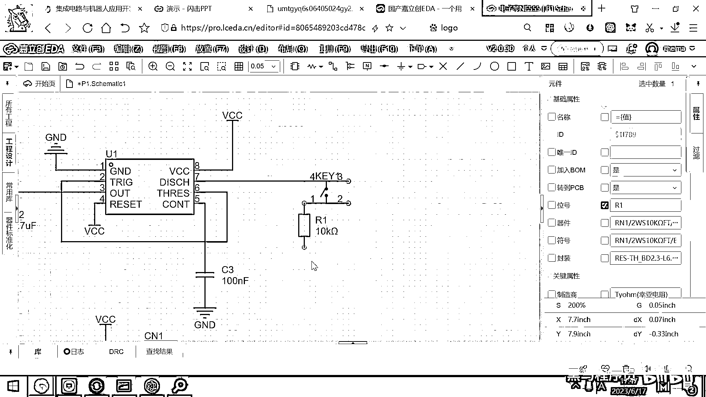
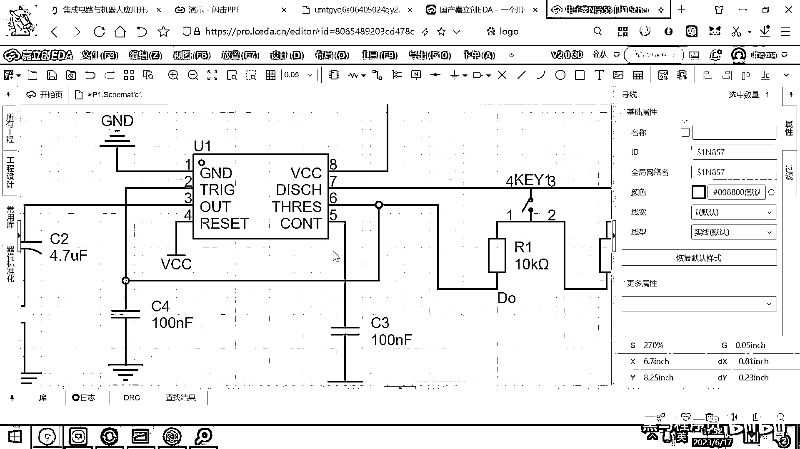
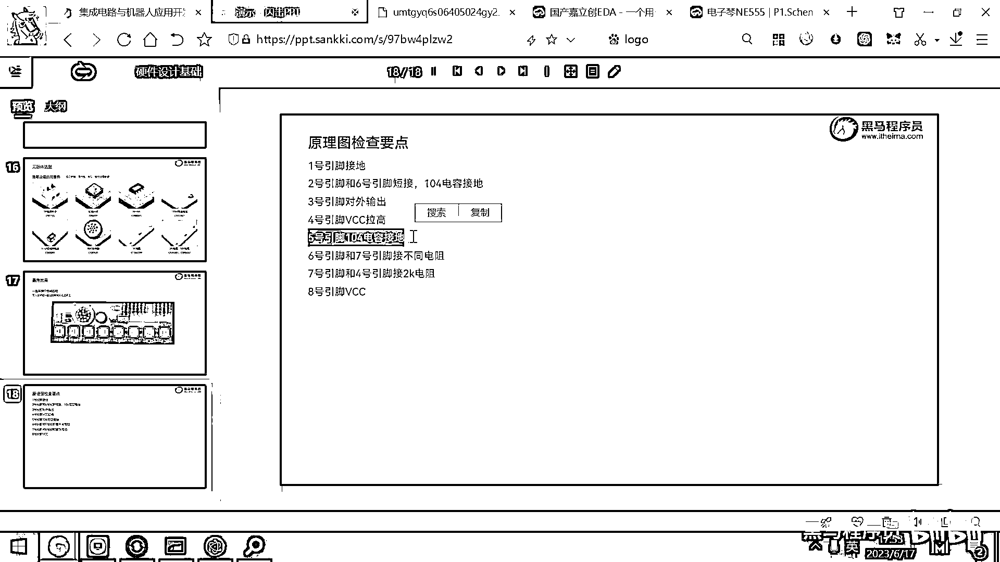

# 黑马程序员嵌入式开发入门模电（模拟电路）基础，从0到1搭建NE555模拟电路、制作电子琴，集成电路应用开发入门教程 - P60：61_电子琴原理图绘制 - 黑马程序员 - BV1cM4y1s7Qk

第一步我们是不是要先把这个原理图给画出来，画这个原理图，大家一定要非常的认真，一个引脚一个功能，一个引脚一个功能的慢慢画出来，这个你千万不要看着大差不差，然后操过来之后就去画PCB了。

最后你PCB生成出来，这个也不想，那个也不想，这有问题那有问题，所以画这个原理图的话，一定要非常认真。

一个引脚一个引脚的去检查。

我们来去瞧一下这个原理图，它实际上用到了一个N155的芯片，对吧，这个芯片的编号，我已经在PPT里面给大家。

已经全都列好了，你就照着这个图去选行元器件就可以了，因为这些元器件，我们都提供的有对应的零件，然后你就按照这样一个编号去选行，最终都是可以去插上的，第一个是N155，它是一个8帧的直插的封装。

叫DIP8，它的封装的名字叫DIP8。

我们先把这个N155主控芯片给放进来，这个点放置，N155的主控芯片，大家看它是不是有八个引脚，GND Trigger，这个就是触发，OUT就是输出，RESET就是重置。

然后SHRED HOLD这个是预值，然后DISCHARGE这个是放电，VCC这个就是电源，这个5实际上就是我们引脚里面做滤波用的，我们来去瞧一下。

这个已经放进来了。

放进来之后看一看原理图，我们从一个引脚一个引脚的去接，对吧，好，先接什么，VCC和GND对吧。

好，所有的芯片，你要想让它去使用，都应该是先把VCC和GND接出来，好，我这个芯片如何供电呢。

那大家看一下，在PPT里面，我们有一个这样的东西叫啥，叫接线端子，对吧，接线端子的作用是什么，它这有一个洞，这有一个洞，然后你把两个电线，一个正极一个负极塞进去，是不是它就可以跟电池连在一起了。

在我们当前这个电路板上，当前的元器件里面，你有没有看到电池。

没有对吧，也没有电池座，你看这个是一个电池座，直接放到这了。

但在这个里面，没有电池座，也没有电池盒，那你要做的事情，就是把我们发的这个九伏的电池，然后用线呢，接到这两个洞里，我们会给大家提供对应的这个线，你就可以接进来了，好，所以呢，要想有电源的话。

是不是第一步。

我们要先把一个供电的这样一个端口给塞进来，对吧，它是一个，供电的这个端口，好，这个端口塞进来之后呢，它一端是接电池的正极，一端接电池的负极，对吧，那接电池的正极，正极它的一个默认名称呢，就是VCC对吧。

这个负极的话就是接D了，然后就接一个GND，好，这个把它给连在一起，好，把它给连在一起，好，那VCC和GND实际上就相当于电池的正极接到这，电池的负极接到这，那VCC和GND接好之后，我们原理图呢。

可以很方便的去连接它，你看以后再需要接D的地方，我是不是就直接在这画一个GND，然后它就接D了，对吧，那需要接这个电源的地方，你就直接在这去画一个VCC，然后它就接到这，画一个VCC，然后它就接到这。

好，那大家看右边这块是电源模块，然后我这个芯片是不是就已经供电了，1号引脚和8号引脚都已经接好了。

接好之后呢，大家再看2号引脚，我们接这个引脚的话，可以按照12345678的这个顺序去接，或者是你先看电源模块，好，这个电源模块，你看它在这个端子上面和下面接了一个C3104，这是啥意思。

104是100n法，对吧，104的电容，好，那以后大家去看别人画的电路图。

经常会见到有人会在正极和负极之间，接一个电容，那接这个电容有什么作用呢，第一个作用就是滤波，因为有的时候你的这个电源呢，可能会有一些信号干扰，短期内的小小的波动，对吧，你加一个这个电容。

它就可以把这个波动呢，给这个减缓一些，我们的电容呢，它可以减缓一些你的电源的波动，好，那我们来看一下这个电容的型号是多少。

找一找PPT，电容的型号是一个100n法的陶瓷电容，我们把这个电容呢。

先放进来一个，好，那它的编号是C77841，我们点击放置，好，这来一个电容，好，这个电容呢，它其实就是接到电源的正极，然后还有负极之间，它实际上就相当于什么呀，相当于你接一个小水桶，对吧，然后如果。

如果产生一些波动，这个小水桶呢可以起到一定的缓冲作用，好，这是一个滤波作用的100n法的电容，好，那这块画完了。

我们来继续呢，看这个原理图，好，4号，看一下2号引脚，好，这个2号引脚和6号引脚干嘛呀，直接短接在一起，对吧，这个这个原理图，我们之前给给大家画过。

2号引脚和6号引脚是短接在一起的。

那简单了，我们来到，这个原理图里面，找到2号引脚和6号引脚，他们之间要干嘛呀，要短接在一起，那就画一个线，2号6号引脚呢。

就被接到一起了。

好，来继续看一下，3号引脚是干嘛的，3号引脚实际上就是输出引脚，对吧，那我们最终的这个方波就是通过3号引脚输出出来，好，那3号引脚，它接的是什么呀，接的是一个喇叭，对吧，就是一个扬声器，接一个喇叭，好。

在这儿呢，大家看到他这儿还有一个电容接在这儿，好，为啥接一个电容呢，其实也是起到这个滤波的作用，因为电容就有一个特点是叫组织流通交流，对吧，因为我这个out就是一会儿高一会儿低，然后这个电容呢。

就一会儿充电，一会儿放电，然后最终它就可以驱动这个喇叭，所以我们在这儿接一个电容，然后接这个喇叭。

好，那这个电容我们看一下它的编号是多少呀，电容是一个4。7μF的铝电解电容，对吧，好，我们把它给画到这个原理图里面。

好，shift+f，我们去搜索，4。7μF的一个电容，对吧，这个电容一块钱，我们放置一下，好，要注意的是这个电容呢，它是区分正负极的，我这个out要么就是高电品，对吧，要么就是不输出，就是低电品，好。

所以这个out应该是接在这个电容的+号的这一端，它区分正负极，接到这个+号这一端。

好，接完这个内容之后，大家看下面是不是就接一个喇叭，然后就接地了。

对吧，那我们把这个喇叭呢，也给它放过来，好，喇叭的这个名字呢。

叫C530，我们直接shift+f去寻找一个喇叭。

长这个样子，然后我们去放置，好，那这就有一个喇叭了，好，这个喇叭大家看一下，喇叭也是区分正负极的，对吧，好，那实际上呢，这个喇叭正负极，你把它给接反，你的喇叭还是能响，也能发出来声音，只不过呢。

就是声音的效果比你正确的接稍微差一点，好，为啥呀，因为这个喇叭，它是你拆开，你就知道它是一个膜，那正常情况下，你正负极接对的话，它这个膜是往外突出，然后发出声音，如果你正负极接反了。

这个膜就变成往里面吸，然后发出声音了，就能听出来一点点的差异，那我们还是最好就是按正确的方式呢，去接这个正负极，好，那这个正确的方式，接正负极的话，这上面是正，是不是这个线要接到下面，然后这个接GND。

对吧，这个就有点麻烦，但是你看，这有这个可以翻转这个符号，上下翻转，你看这个就翻过来了，这种EDA软件是很智能的，好，那我这个一连连完，然后下面要连一个啥呀，连一个GND，好，我们在这搞一个GND。

然后直接W一连，这个三号引脚就连完了。

好，那继续呢来看这个PPT，三号这样一圈，是不是接地已经连好了，我们来看四号引脚，四号引脚在哪呀，四号引脚是这个复位引脚，那你看这个芯片手册也叫做始能引脚，什么是复位引脚，始能引脚呢。

就是你给这个引脚接一个VCC高电压，这个芯片就工作，你给这个引脚接一个零幅，接一个GND低电压，这个芯片就断电不工作了，这个理解吧，好，那其实你能想象出来，这个芯片内部到底是怎么设计这个reset的吗。

能想象出来吗，就其实就是如果这有一个五幅，那我里面的电路就被打开，对吧，那如果这是一个零幅，我这个电路就断开了，这个芯片就不工作了，所以这个reset呢，根据这个原理图，应该是接一个高电频。

我们直接给它接一个五幅就可以了。

好，这个reset接一个高电频，我们怎么接，就是把这个VCC给接进来，对吧，好，这个VCC根据你的电池的电压来决定的，这个VCC我们接九幅的电池，VCC就是九幅，如果你接一个五幅的USB口。

那这个VCC就是五幅，这个电压是由谁来决定的，是由这个电池插进去的，你插的是几幅的电池，这个VCC就是几幅，对吧，好。

所以叫VCC。

好，四号引脚我们也画完了，那接下来继续来看了，画五号引脚，五号引脚在哪呀，瞧一瞧，五号引脚呢，这个是直接接了一个104的电容接地了，对吧，这个其实是起到一个滤波的作用，让这个芯片工作的更稳定，好。

所以五号引脚直接104电容接地。

我这儿已经有这个电容了，Ctrl+C，Ctrl+V，然后104电容接地，对吧，大家看一下，我这个一接，接到这儿，然后我们再去找一个GND，然后把它给连在一起，这个没有鼠标地，然后。

你看到这样的凸起来一点，对吧，这个就说明你的线画的有点歪，一定要把它给修正一下，正常的话，你这个线连好之后，是一个很漂亮的一条线，如果你看到了点啊什么的，你要仔细检查一下，最好修正一下。

要不然会导致这个原理图出错，五号引脚我们也搞定了，搞定了五号引脚。

现在就开始看六号引脚了，好，这个六号引脚，大家上午我们讲这个NE55的时候，你知道这个六号引脚，其实决定了它的放电速度，对吧，这个六号引脚是走这样一圈，然后来到这个七号去放电，对吧，这个六号引脚呢。

那最大的电阻就是刀，然后这个是最大的电阻就是刀，然后如果这个电流从这个S2过来，就是Ray对吧，从S3过来就是Doremi，Fasolasi，刀，是这样一个样子的，好，那看六和七之间。

是不是有很多个开关，然后呢按不同的开关，就会有不同的电阻，接通这个六和七啊。

对吧，大家看明白了吧，好，那我们呢在六和七之间，就应该是有很多个开关，然后不同的声音就接不同的这个电阻。

好，那这个开关用哪一个元器件呢，用这个元器件，C84931。

我们把这个C84931呢给它放进来，好，C84931，找一找，点击放置，好，这个开关呢就被放过来了，好，开关就被放过来了，好，那这个开关大家看一下，它是不是转一圈，然后要要接回这个六啊。

我们这个七上面接到这个开关的上面，然后这个下面是不是应该接电阻。

然后接回这个六呀，对吧，你看你看这个原理图，从这个七经过一个开关，接回六，对吧，好，第一个这个电阻是多大呀。

是10K的10K的电阻，好，来找一找10K的电阻是这样一个编号。

我把它给放进来，10K的电阻，我们点击放置，然后这个10K的电阻呢就放过来了，我这样去放一下，好，这个电阻是应该经过这个电阻之后连到谁呀。

你看你按这个开关。

从七到六之间就就接上了这个10K，对吧，那所以你从这儿，再拐一下，然后连到这个连到这个六就可以了，对吧，好，那这样的话，这个其实就是高音的都，那为了方便起见，你可以在这儿搞一个文字的小符号。

这个是高音的都，好。

那这是高音的都，好，那第一个画完了，那剩下来的画法是不是就完完全全一模一样了。

对吧，那后面这有一个1K的，然后接下来有一大堆2K的，我们先把这个1K的给放过来。

好，1K的电阻是这个编号。

那shift+f，然后找到这个1K的电阻，点击放置，对吧，还是这个样子，然后我们是不是可以复制一个按钮，对吧，把这个往左放一点，往右放一点，然后这个线是不是连到这儿，对吧，然后然后这个线应该怎么连。

应该是连到这个地方，对吧，那大家想一下，你按下这个按键，这个7和6之间的电阻就变成10K+1K了，对吧，就是11K，好，那这一块搞好之后，我们继续在拷贝粘贴一个这个按键，然后把这个一连。

那下面这是不是也要有一个电阻。

这个电阻根据原理图里面，这应该就是2K了。

这后面全都是2K了，对吧，那2K的电阻，我们找一下它的编号。

然后shift+f把它给放置过来，好，那这点击一下，它要先加载完才可以点击放置，好，加载完了点击一下放置，我们这个电阻就放到这儿了，这个电阻是不是应该这样去接，然后按这个按键的时候。

这个电流是经过R3经过R2再经过R1回到这个6，对吧，好，那一共还有几个2K呢。

数一数，12345，还有5个2K。

那我们就快速的这样复制粘贴一下就可以了，一个2K，两个2K，对吧，然后三个2K，好，这个四个2K，好，最后还有一个五个2K，这就画完了，对吧，然后大家把这个给连上，这个给连上，然后，这个手千万不要抖。

你看我的手一抖都不知道哪连到哪去了，好，这个给连上，然后这个连上，这个连上，这个连上，好，我们来看一下是不是跟刚才所看到这个图是一样的，那从最右边开始就是，Doremi Fasolasi，对吧。

那为了这个方便起见呢，你以后理解这个原理图方便，那你就在这写一个do，然后在这呢，写一个re，对吧，然后在这呢，写一个mi，然后在这写一个fa，在这写一个Doremi Fasolasi，然后la。

然后这个就是si，对吧，好，那行，那每个按键是什么声音，这个就画完了，好。

画完这一块之后呢，我们继续来看这个原理图，刚才已经画到几了，画到这个7了，对吧，好，那8也是有了，7和4之间是不是还有一个1K的充电用的电阻，对吧，然后2和6，他下面要接一个电容。

这个是用来充放电的电容，对吧。

好，这两块还没有画，好，2和6的连线，下面我们要接一个电容，这个电容正好还是，还是多少呀，100n法的，你就选中这个control+c，control+v，然后再来一个GND就可以了，好。

这是这是2和6之间，对吧，你看一下2和6之间。

接一个104的电容接地，好，这个是有了，然后7和4之间有一个1K的电阻，这个电阻是充电用的。

对吧，那我们现在7和4之间有电阻吗，没有对吧，7和4之间还是没有电阻的，那我们我们怎么接好看一点呢。

你看7这出来一个1K的，然后实际上这个4接的也是VCC，对吧，那就是这个7和VCC之间，接一个1K的就可以了。

对吧。

这个是这个是等效的，那所以我们这个7和VCC之间，接一个1K的电阻，1K的电阻这已经有了，我control+c，control+v一个，然后我们在这儿把它给接到这个VCC上，就可以了，对吧，好。

这就是7和，因为4也是VCC，对吧，所以我们7和4连接，然后它接了一个1K的电阻，好，那整个这个原理图呢，我们就把它给画完了，好，画这个原理图的话呢，一定要按照我们刚才的这个办法。

就是一个引脚一个引脚的去画，一个引脚一个引脚的检查。

好，我在这个PPT里面呢，给大家列出来了这个检查步骤，原理图的检查要点，这个要点我们来看一下，1号引脚接地。

来去瞧一瞧，1号引脚有没有接地啊，接地了对吧。

好，然后再看第二个要检查的要点，2号引脚和6号引脚短接。

然后104电容接地，好，来瞧一下，2号引脚在哪儿，在这儿，然后跟6号引脚是不是连在一起了。

104电容接地，对吧，这个是没问题的，然后呢。

3号引脚是对外输出的，我们来观察一下，3号引脚就是out。

就驱动那个喇叭了，对吧，3号引脚对外输出，好，4号引脚VCC拉高。

保证这个芯片可以工作，好，所以4号引脚直接接VCC拉高。

然后呢，5号引脚104电容接地，这个是滤波用的。

你看，5号引脚104电容接地，好，这个没错。

然后6号引脚和7号引脚，接不同的电阻，来去瞧一下。

6号引脚和7号引脚之间，是不是一大堆开关，接不同的电阻。

导燃密发骚，对吧，好，这是6号引脚7号引脚不同的电阻，7号引脚和4号引脚，接一个2K的电阻。

好，7号引脚和4号引脚，就是VCC之间。

接一个2K的电阻，我们这个原理图是几，是1K对吧。

好，这个接一个1K的也行，就反正都不是特别精确。

一个大体的估摸，好，1K的电阻，好。

然后最后是什么，8号引脚接VCC，我们来去瞧一下。

8号引脚在哪，8号引脚是电源，对吧，接VCC，好，那原理图就画完了，一定要自己按照这个步骤，仔细的检查一遍，如果你这一会儿你不检查，等到你板子到了之后，你去检查起来，那就已经悲剧了。

对吧。

