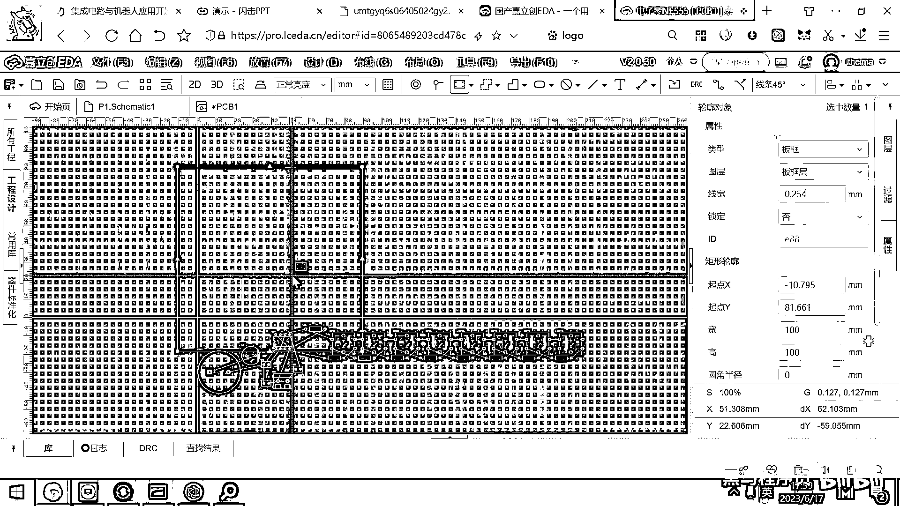
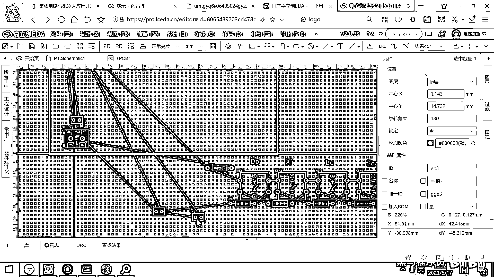
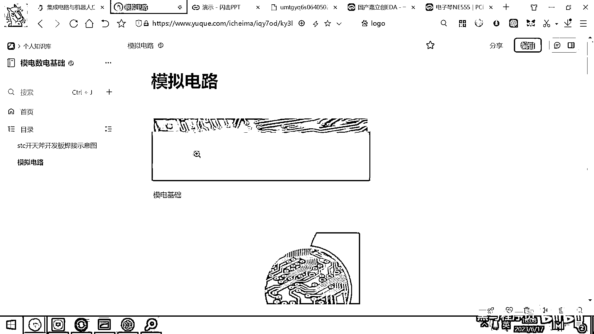

# 黑马程序员嵌入式开发入门模电（模拟电路）基础，从0到1搭建NE555模拟电路、制作电子琴，集成电路应用开发入门教程 - P61：62_电子琴的pcb元件摆放 - 黑马程序员 - BV1cM4y1s7Qk

这个画的方法也很简单，这个设计里面干嘛呀，根据这个原理图转成这个PCB对吧，好，这些所有的零件呢。

就元器件呢，就会自动的被添加出来了，好，大家看啊。

这个就稍微复杂一点的小电路了，这里面有好几十个元器件啊。

那大家看哎，这么多一大堆了，对吧，好，那这个线呢，我们要把它给连起来，连之前呢，你是要先做一下规划的什么意思啊，连之前你要先规划一下你这个板子有多大对吧，好，因为这个家立创打样呢。

是十乘十以内是免费的对吧，那如果你的这个尺寸宽高都超过十厘米了，你打印这五片这个PCB呢，要花个六七十块钱啊，这个就非常不划算啊，那所以呢，我们尽量的还是遵守它的规则啊。

在十乘十以内把这个板子设计出来啊，这样就相当于是白嫖了对吧，好，那家立创的也喜欢大家呢，免费打板好，那那第一步我们要把这个板子控制在十乘十之内啊，你看一下这个地方有一个有一个按钮叫什么呀，叫板框对吧。

那这个板框我们就去指定了好，那目前的这个单位是是Neo啊，这是英寸的这个单位，我们先把它给改成毫米。

这样的话呢，你看起来就容易理解，好，那我们这个板框呢。

他要求是十乘十以内对吧，那你就一百乘一百好。

这样的话呢，就满足他的要求满足他的要求。

只要你把元器件全都摆到这个框框里啊，那你生产出来的这个PCB呢，就是免费的啊，对吧。

你生产出来的PCB就是免费的好，那现在的话，我们还需要干一件事情。

就是我已经忘记这每一个键是干嘛的了，好，这个key8大家看一下是刀对吧。

好，那所以你第一步要干的这个事情呢。

是在这个key8上呀，最好是给他写一个写一个私印对吧。

这个就是刀好，那那等一会你一拖动，你还知道这个是刀，这个是这个是高音的刀还是低音的刀呀。

我们来看一下，看一下这个原理图，原理图如果是原理图去哪了。

原理图在这儿。

最右边的这个是最低音的刀对吧，Doremi Fasolasi，然后这个最左边的是最高音的刀。

好，那看完这个之后，我们来来说了，这个是最低音的刀。

然后这个是低音的re对吧，好，那再来一个mi，然后再来一个fa。

好，Doremi Fasolasi，这个来一个s，Ao，Sol，然后la，然后再来一个si。

要把这个私印给标清楚。

然后你最后弹的时候就就会舒服一些。

对吧，好，这个刀是高音的刀了，我们可以把这个线宽的给调的稍微宽一点，那大家就可以看到这个这个字符呢。

稍微粗一点对吧，这个是高音的刀，那那正常我们弹奏的话。

是不是刀在左边，re在右边，对吧。

应该是应该是把这个挪到最左边，然后然后左右交换一下。

对吧，好，这个一小会我们去处理一下，好，这个喇叭呢。

我们就直接把它给放到这个上面就可以了，对吧，这放一个喇叭好。

那这个喇叭旁边呢，是不是有一个电容对吧，好。

这个电容呢，我们就放到这儿好，N155是我们的控制芯片。

对吧，你这个是核心，你把它放到一个地方好，这个电源呢。

你就放到这个板子的某一个角落，方便你接线，对吧。

好，那，我们去看一下这里面的几个电容，你原理图在是怎么画的，然后你最终画这个PCB的时候就应该是怎么画。

你看这个C1靠近这个电源是对这个电源滤波的。

对吧，好，那我们选中这个C1，它右边有一个叫交叉选择。

哎，他就直接跑到这个地方帮你找到这个C1了，好，这个C1呢，我们就放到这个电源的旁边啊。

它起一个滤波的作用。

对吧，好，然后呢，我们再去看一下这个C4，它是比较靠近这个2和6的引脚，然后这个C3呢。

是靠近5的这个引脚，对吧，那你这个C2呢，你就C4是比较靠近。

我们看C4是比较靠近2号或者6号引脚。

好，那C4呢，我们让它靠近一点这个2号引脚。

对吧，离这个2号引脚稍微近一点。

然后我们的C6呢，就就往C3呢。

就往这边去放一下，它比较靠近这个引脚。

对吧，好，那那剩下来的就是Doremi Fasolasi了，对吧。

我们需要把它给摆到这个实诚实的空间上，摆到这个实诚实的空间上，第一个摆的就是DAW，我把它给摆过来，这是我们的DAW，然后第二个摆的是这个RAI，然后摆这个MI，然后摆这个FA。

对吧。

哎，摆了这四个好像好像这个空间就已经就不够了，对吧，那你再去摆这样一行，然后摆这样一行，然后摆这样一行，然后摆这样一行，先大体的摆一下，然后这有一个电阻放到这。

那你预览一下这个板子。

看看它它这个长什么样子，好，那目前我们也没对齐。

也没弄啥，对吧，这个板子肯定很丑，然后这个是喇叭，这个是电容，对吧，这是N155，这是Doremi Fasolasi，好，那接下来你要干的这个事情是不是就让它摆的好看一点，这个对齐一下。

然后就来点美感了。

对吧，好，那接下来的事情就是我们要让它变得美丽一些。

那怎么美丽一些呢，其实对称就是美。

对吧，你应该你看左边这些东西你调整一下。

然后这个也调整一下，这个往上面放一点。

这个往这放一点，这个往这边放一点。

对吧，这个往角落放一点，就你摆的规则一些就漂亮一些。

好，那在EDA工具里面有很多很方便的按钮，可以让我们把这个板子摆的很漂亮，你看第一个按钮是什么呢。

你先选中这上面的四个按钮，你先选中这四个按钮，选中完毕之后，你看一下它有一个对齐的操作，我的这个屏幕比较小，你们屏幕大一点就在正上方，你看这有一个叫顶部对齐，哎。

这个上面是不是就对齐了。

对吧，那对齐了就好看一些，就整齐的话就会漂亮不少，好，这个是上面这个对齐。

好，那对齐之后，他们的这个间距还是不是一样大小的，对吧，你选中，你选，我把这几个丝印也顶部对齐，好，大家看选中这几把key5，这些其实对我们焊板子来讲用处不大，我就把它给藏起来，藏到这里面。

你元器件往上一焊，这些字就看不到了，对吧，好，这个你把它放到这里面，然后我这个DoremiFa，我选中它，选中它，然后也是按一下这个顶部对齐，好，这还有一个按钮叫分布。

这个分布就是让他们的间距保持一致。

好，你下面这个地方也是选中它，然后点一下这个分布，好，大家看他们间距也一样了，对吧，一旦这个排列整齐了。

这个看着就舒服很多了，然后你看这个地方，我们是不是也可以这样摆一摆，摆完之后你就选中它，选中它，然后这个顶部对齐均匀分布。

好。

这个DoremiFa就搞好了，下面的这个骚拉西刀是不是也是一样的。

对吧，好，那我们选中这些元器件。

然后来一个顶部对齐均匀分布，好，这个分布完了之后，上下最好也对齐就好看一些，对吧，我们把这边的上下也对齐一下，画PCB的布局，实际上是一个慢工细活，你要很有耐心，在这一点一点的去调一调。

最终画出来的就会比较好看一些，如果你搞得很急躁，对吧，画出来的就不太漂亮，我往这挪一点，下面也是一样。

我们顶部对齐均匀分布一下。

大体上就长这个样子了，好，这个元器件的布局。

我们就按照这种方式去排布一下了。

这既利用了加力创的规则，然后又把所有的元器件给摆放整齐了。

好，现在这个板子我们去预览。

它大概就长这个样子，好，这个板子现在在预览。

你焊接出来大概就长这个样子，现在右上角，你看，这是空空的一大片，看着不美观，对吧，怎么解决这个问题，其实很简单。

你往这上面画个画，然后写个撕印，弄个啥都可以，对吧，好。

写啥，反正我是五音不太全，对吧，我要想用电子琴去弹个音乐的话。

我必须得有这个，得有这个谱子，你就可以把这个谱子给它贴到上面。

我们去看一下，在PPT的最下方，是有我们的音乐的谱子的，对吧，你打开，打开链接，好，我们给大家贴了两首歌，两首歌一个是粉刷匠，一个是两只老虎，反正都比较简单，你看这个就是。

53 53 53 124 325，对吧，你就把这个东西，这些素质写一写。

然后贴到你的版图的上方，以后你就可以看着去弹奏，粉刷匠了，对吧，好，那有同学说。

直接把这个图片贴上去行不行，我不太确定。

它分辨率够不够，我们试一下，我把这个保存到桌面上。

这个是外部P的图片。

还保存不了，我用截图工具，然后我们截这样的一段内容，然后去完成一下，保存。

对吧，把它保存成一个GPG的，放到桌面上，好，这个图片保存好之后。

现在我们把谱子，把它给导进来。

对吧，要注意是导到顶层，丝印层，好，文件我们选择导入一个图片。

粉刷匠的谱子就在这，好，这个效果比较糟糕，对吧，好，因为它实际上是用黑白图像去显示，我们看一下锐化，平滑。

好。

这个效果可能就不太好，导进来之后，导进来之后。

看一下预览，能不能看出来效果，预览的还是比较真实的。

3D预览还是较为真实的，看不出来，对吧，那，这个蝎形文字了。

对吧，那你可以怎么弄呢，你就直接在这，乌三乌三乌三义。

对吧，你就这个样子就好了，好，那有些同学像我一样。

这个五音不全，你就不要在这，do re mi fa了，我到现在这个五对应的是。

do re mi fa sol，这个五对应的是sol，我就要想一会才能对应起来，那你就干脆在这来一个，12345671就好了，那你弹奏的时候，就直接，5353531，这个就弹出来了，好。

那我在这就不演示了。

这个诗音我就不画了，接下來我們就考慮一下如何去佈線。

