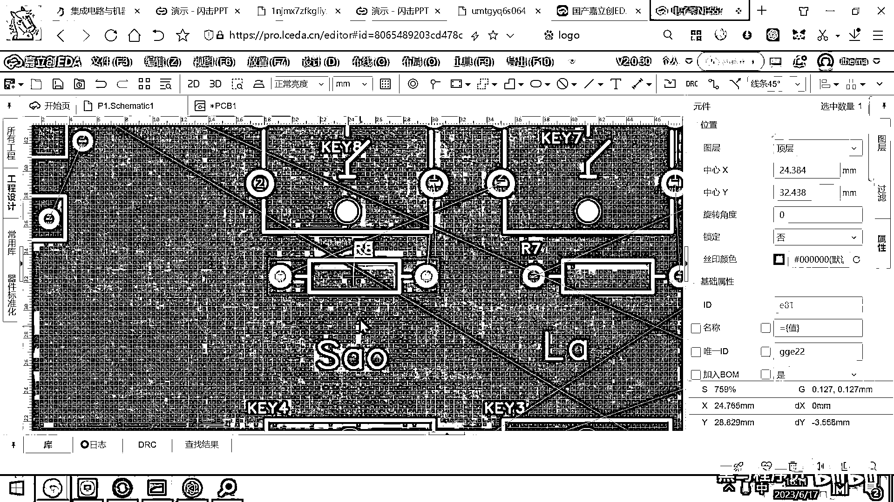

# 黑马程序员嵌入式开发入门模电（模拟电路）基础，从0到1搭建NE555模拟电路、制作电子琴，集成电路应用开发入门教程 - P62：63_布局和丝印调整 - 黑马程序员 - BV1cM4y1s7Qk

好 那另外呢 还有一个很重要的小细节。

在这儿要给大家强调一下。

就这个PCB板子啊，它现在还是缺很多丝印的，如果你这样就一会画完了，然后打印出来，你焊的时候就就有点小崩溃。

你焊的时候你要先打开你的这个原理图，然后你去看一看这个R8。

看完这个R8之后呢，你再跑到这个里面去找一找，这个R8是2000欧。

这个时候你才能把这个元器件给焊出来。

好 所以为了降低大家焊接的这个难度，另外就是方便你自己使用。

你在这儿是应该去主动的去把对应的丝印给添加上去的。

比如说这个R8是这个2K的电阻。

对吧，那你在这个地方就就就印一个丝印2K，好 以后你的PCB板一到货。

你就知道 哦，这弄一个2K的电阻就行了，那同样的，这R7 R6 R5 R4一直到R3都是2K的对吧。

那你就把这个丝印呢。

就这样复制粘贴复制粘贴复制粘贴。

一直到一直到这个R3都是2K的。

那那接下来的话，我们的R2是1K。

R1是10K对吧，那你这个R2呢，你看一下R2呢。

就是1K，你在这儿写一个1K，然后R1呢。

这就是一个10K啊，你你现在稍微麻烦一点点啊。

你这个板子过来，你焊的时候呀，就疏忽十点点啊，所以这个一定不要省略这个步骤。

好，这个R9的是1K对吧，你看一下，哎，这有一个R9，那你就指定一下这个是1K，好。

实际上我们这个R9给大家提供的这个套件呢，应该是一个2K的啊。

这个无所谓了，好，然后这个N155是不是就在这儿。

然后这有几个电容啊，那这一次呢，由于我们这个板子非常简单。

这几个电容，大家看一下全都是什么呀，100n法100n法100n法的对吧。

全是104的，那这个电容的大小，你不标也无所谓。

就不用标了，好，还有一个电容是带正负极的对吧，这个电容长得比较大。

一看不一样，你就知道焊到这儿了，然后这个呢，就知道焊到这儿好。

这些小细节处理完了，好，还有一个重要的小细节就是这个电源端子。

你看这个电源端子左边是VCC。

右边是GND对吧，那你一定要把这个丝印的给他标出来。

你一定要把这个丝印的给标出来，要不然的话。

等你的板子到手了电池，你也有对吧，然后你怎么接线，哪边是正极，哪边是负极，你自己都搞不清了，好，所以这个VCC GND。

这个应该你要把它给标出来，好，或者最简单的标法呢。

就是你在这写个加号，一看这个就是正极，然后在这呢，你写一个减号，一看就是负极，红线接左边。

黑线接右边对吧，好，这些这些就是你焊接合使用的小细节呢。

一定要把它给加上，否则的话呢。

后面你焊的时候就很麻烦很麻烦，那这个骚拉西刀。

我都往下调一调。

好，这些搞完之后，我们现在就可以去布线了，在布线的时候呀。

这个大家呢，还可以对你的这些元器件的左右位置。

或者上下位置呢，做一些微调，你看一下我这个布线，我这个这有一条线要连到这儿，对吧，然后这条线要连到这儿，那如果我把这个给扭一扭，大家看这个接线是不是就舒服一些呀，对吧，你看这个地方你扭一扭。

这个接线就舒服了，这个地方扭一扭接线就舒服了，就所以呢，你在画这个线的时候呀。

如果你觉得这个接线不太舒服，你还可以去调整一下这个元器件的摆放方向，好，这样你你画起来以后就会就会更加舒服一些，对吧，你看。

你看我这样调一调。

就变得舒服一些了，那大体上该调的东西都已经。

你看，你看这个电阻，如果是如果是这样放。

是不是接线就接的容易一些，对吧，你你这里面能调的。

你就先大体的调一下，这样接线的就会更方便。

