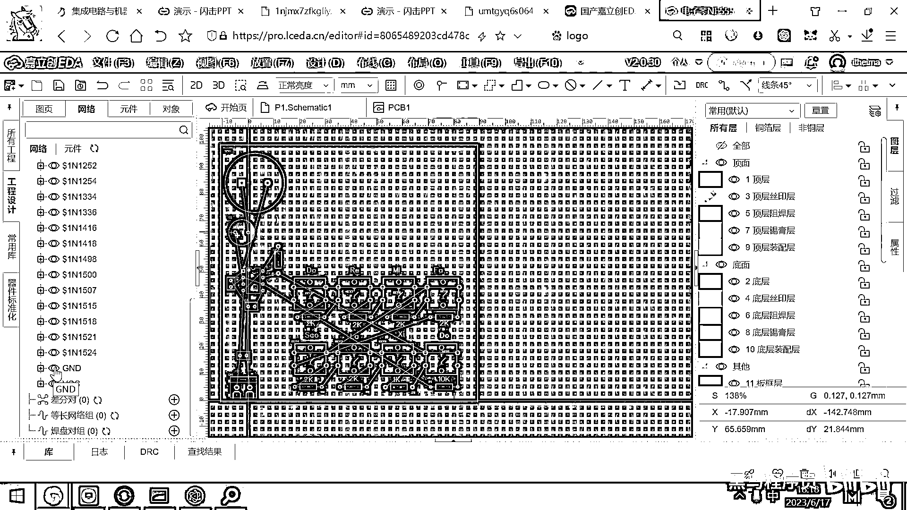
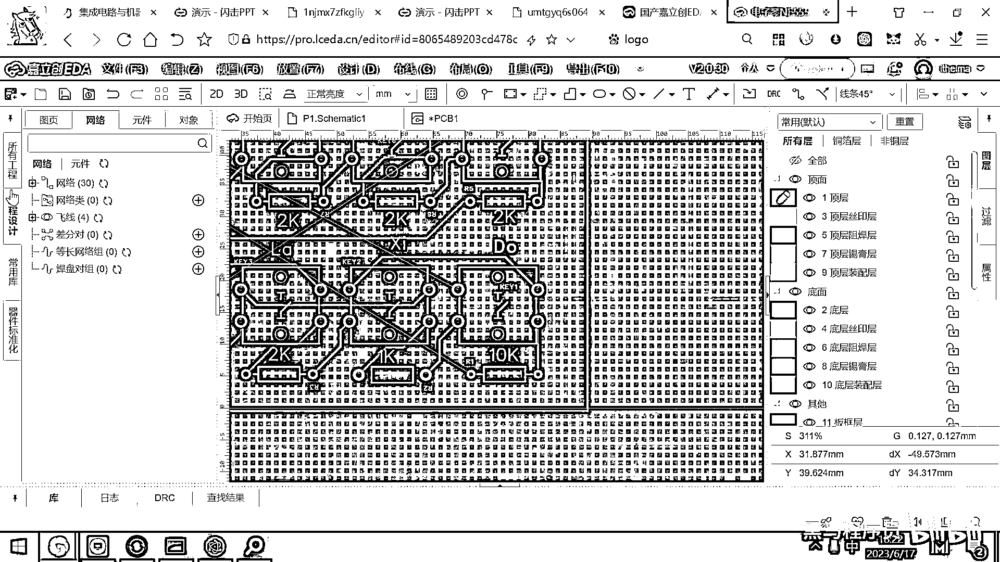
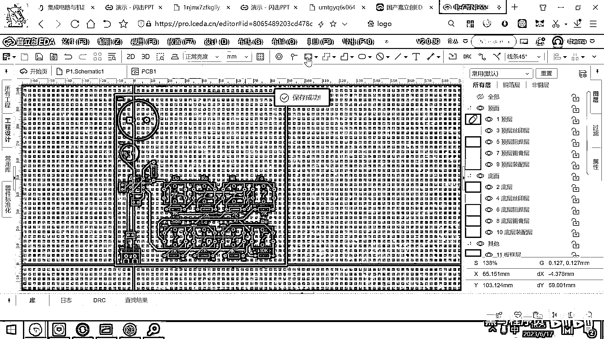
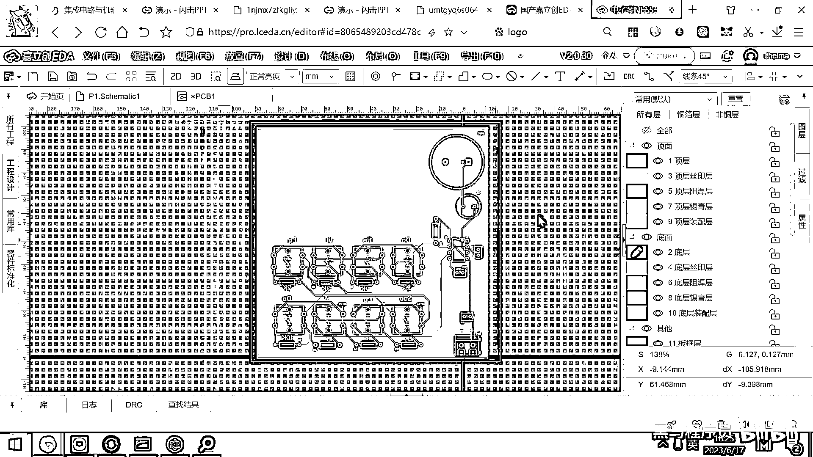
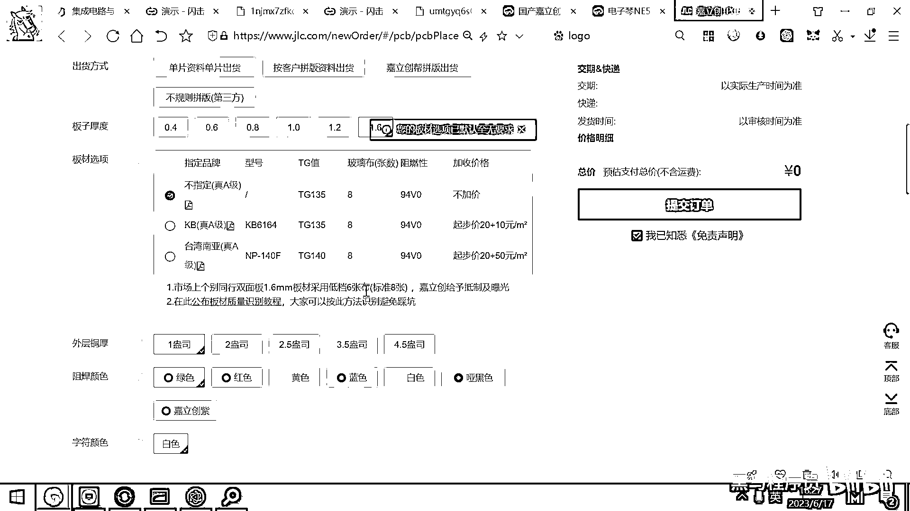

# 黑马程序员嵌入式开发入门模电（模拟电路）基础，从0到1搭建NE555模拟电路、制作电子琴，集成电路应用开发入门教程 - P63：64_电子琴的pcb布局 - 黑马程序员 - BV1cM4y1s7Qk

领基础许爱提 月薪过万 就来黑马程序员，之前我们画的几个小电路都非常简单。

线很少，你觉得连起来呢，这个没什么难度，对吧，那当你的这个元器件达到七八十个，一百个或者甚至几百个的时候，这个布线呢，就就不太好布了啊，就要一边布一边看，然后还要考虑这个线之间的冲突，对吧，好。

那有一个很好的布线技巧是什么呢，就是先把GND，先把GND给隐藏起来，为啥呀，因为GND的话，我最后可以整体给这个板子铺一下铜，那整个这个板子都是GND，那随便一接就连通了，对吧，那所以最简单的办法呀。

就是我们先把这个GND给它隐藏起来，好，那怎么去做呢。

我们来去看一下了，这个里面是有很多的这个线的。

对吧，好，这个就是所有的这个飞线，好，在这个，这个一变小的话，有一些东西我就，我就不太好找它。

我们先按下这个W进行这个布线。

然后这个，我等一下啊。

好。

那大家如果找不到这个标签的话，你们你们可能默认是在这个地方。

然后你先点一下这个工程设计，然后在工程设计的上方呢，大家看它隐藏的有几个标签，对吧，好，第一个是叫涂验，好，第二个呢就是网络，这个网络呢，实际上就是你的所有的线，在这个网络里面呢。

你找到这个飞线的一个标签，然后看到这个下面有一个GND，它左边有个小眼睛，对吧，你点一下这个小眼睛。

好，我们我们给大家看一下这个效果，现在是有这个小眼睛的，对吧，你点一下这个小眼睛，你发现什么呀，这条线不见了，对吧，实际上是这条线呢，他把它给隐藏起来了，这个GND网络呢，你可以先不去布线。

这也是一个非常好用的小技巧。

好，那这个搞完之后呢，我们现在就开始去去连这个线了。

对吧，从这个VCC开始连一根线，然后这个VCC连到我的芯片的这个引脚上。

对吧，好，那那接下来的话呢。

我这个芯片是不是有一个滤波的，电容。

然后这个地方是不是也接了一个电容，然后这儿呢。

他往上去来了一个输出，对吧，三号引脚输出。

然后通过这个输出，然后驱动我们的喇叭。

好，这块就布完了，好，布完之后呢，大家看这个引脚是不是跟这个引脚是连在一起的呀，对吧，好，然后这个引脚跟这个线是连在一起的，哎，现在大家看，这条线还能连吗，连不了了对吧，那怎么怎么连这条线呢。

背部还是可以连的。

你按这个alter+F就可以来到这个板子的背面了，这个背面你再去布这个线。

你看一下刚才这连不了的地方。

是不是直接就是一个蓝线了，对吧，那你再按一下alter+F切换到这个板子的正面。

那你就可以继续连线了，好，这个正面的线是红线。

对吧，正面的线是红线，好，那我们继续来布这个线。

然后看一下这上面一和这个一和这个是连在一起的。

对吧，好，然后我们再看这个线跟这个线是连在一起的。

然后这个线跟这个线是连在一起的。

好，你每连完一根线，这个蓝色的标记就会消失。

好，那你看这根线是跟这根线连在一起的。

好，往上来一下，不要走这个90度的直角，连到它，然后这个是连到这儿，对吧，那同样的这个也是弯一弯，然后连到这儿，这个呢，连到这儿，这个弯一弯，连到这儿。

这个就是体力活了。

有一个专门的职业就是叫PCB的layout工程师。

这个layout工程师呢，就是专门连这个线的，大家不要觉得这个活技术含量低。

这个活呢，它还是又需要经历又需要经验的，好，为什么呢，因为现在我们的元器件很少。

这个板子的体积呢又很大，那假设呢，我告诉你，我需要在一个两厘米乘两厘米的板子上，布上几十个元器件，你还要把它线给连上，这个就比较难了，好，但是呢，基于这个数学原理。

就是只要你的板子的面积大于元器件面积的1。5倍，其实理论上你就可以把这个线全都布好，这个肯定就是可以布好的，好。

那我们看这个是连到连到这儿的。

然后这个是连到这儿的，对吧，然后这个呢是这个是连到这儿的。

好，那那接下来的话，我们这个线要连到上方，对吧，那我们走一走，连到这个上方。

然后这个线是，这个线是要连到这儿。

对吧，这个线连到这儿，这个线呢连到这儿，你其实你摆放的有规律的话，你布的这个线也可以完完全全都是一样的规律。

我现在画的就比较随意，其实真正的优秀的画法应该是什么呀，这个到这个的线跟这个到这个的线跟这个到这个的线都是长得完完全全一模一样的，对吧。

因为他们的位置都是一样的。

好，那现在看一下还剩几条线，你打开这个工程设计。

然后你点一下这个刷新，你发现还剩四条线没有画。

对吧，那这四条线怎么画呢，我们看一看还缺哪四条线。

好，从这个地方要到这儿有一根，对吧，好，这个地方很远，然后到这儿有一根，这儿到这儿有一根，这不太好背。

不太好布了，对吧，由于我们是双层板，这个其实很简单。

那正面你不好走，我就走这个背面就可以了，对吧，好，那你看我们这一个线。

这一个线，我就可以这样走，然后这样走，然后直接就连到这儿了。

对吧，好，那另外还剩几根线，你看这根线就就直接这样走。

然后拐一拐拐一拐就连到这儿了，好，还剩下一根线，哎，这根线你看，你看走背面的话被他挡住了，对吧，走正面的话，有一堆红线挡住，好，有有很多种做法了，第一种做法呢，就是你把这个线重新画一下。

你看他挡着别人了，对吧，你把这个线重新画一下。

你让他先往下面去走一点，对吧，好，往下面走一点之后，你再在这个上面，然后走过来，好，这就画通了，然后在这儿呢，你就很随意的就过一下。

然后连上。

好，这个就连完了，这是一种做法，好，还有一种做法呢，就是大家如果我给大家演示一下这个做法吧。

你看现在我现在想去过这个线了，对吧，我做一个蓝色的线。

这个蓝色的线到这儿被挡住了，对吧，被挡住了。

这怎么办呢，你可以先按一下V，就是你在这个地方按一下alter+V，什么意思呢，他就会在这个板子上打一个洞。

他就会在这个板子上打一个洞，这个洞呢是上下贯穿的，然后上下导通的。

那打完这个洞之后，你看一下我现在是不是可以在另外一面去走这个红色的线了。

对吧，好，这个红色的线。

那你直接这样连上就行了，有的时候呢，你这个走完这个红色的线之后。

你这个上面又被挡住了，你就可以在这儿打一个V。

又打了一个洞，又来到这个背面了，然后你再弄一个蓝色的线。

这样一接就接上了，好，这个呢就是以后你在画这个板子的时候。

你说我这个线过不去了，过不去你就打一个洞。

钻到下面，在下面走一圈，再打一个洞，再钻回来，那这个线呢。

你就全都布完了，好，这个布完之后呢，现在板子呢还没有铺铜。

我们需要对这个板子进行铺铜，对吧，那铺铜就是直接框选这个框。

然后干嘛呀，基因D网络全部铺上。

对吧，好，那这个板子呢就铺完铜了。

好，那来到这个背面，来到这个背面，按一下alter+F，然后呢。

再来去铺一层铜，这层铜呢，就是底层的铜了。

是蓝色，好，那整个板子呢，我们就画完了，好，来预览一下效果。

看看看看这个板子长什么样子，好。

那Doremi Fa，Sola Si Do，对吧。

然后这些电阻呢，你都标的有，以后焊的时候呢，很方便，好，这个正极。

负极呢，你在这也标了，以后装电池呢，也很方便，好，然后这是正面。

对吧，铺的有铜，比较好看，然后这个背面呢，你看你也铺了铜，然后这是背面的几根线，对吧，好，这个线你可以把它走得更美观一点。

看着更好看一些，好，那行，那现在呢，板子画完了。

剩下来的最重要的一步是什么呢，在这个设计里面。

大家要记得去检查DRC，如果这个DRC全都通过，没有任何错误，好，那这个板子呢，你就可以生产了。

这个板子上用的所有的元器件，我们都会提供，然后大家呢就点击这个下单，点击这个下单。

对吧，然后PCB下单，检查一下DRC没有错误，然后直接进入到这个下单页面，就可以去下单了，好，那明天呢是休息。

然后大家没事干的话。

就可以把这个电子琴呢给画一画，然后画完之后，你把订单提交给工厂，那大概后天，大后天，可能大大后天。

最迟最迟大大后天，你就可以去拿到这个板子了，在所有的同学都拿到这个板子的时候呢。

我们就给大家发元器件，你去焊一焊，听听响，看看这个东西，看看这个东西能不能，能不能这个正常的工作，对吧，这个就相当于是你做的。

第一个小的电子产品了。

选一下这个优惠券，使用优惠券。

对吧，然后提交订单就行了，好，那这个板子呢，我就不去下单了。

因为这个免费券，我们也经常要做一些别的实验。

我就不浪费这个券了，谢谢大家，感谢观看，感谢观看，感谢观看。

感谢观看，感谢观看，(CC字幕製作:貝爾)，MING PAO CANADA | MING PAO TORONTO。

