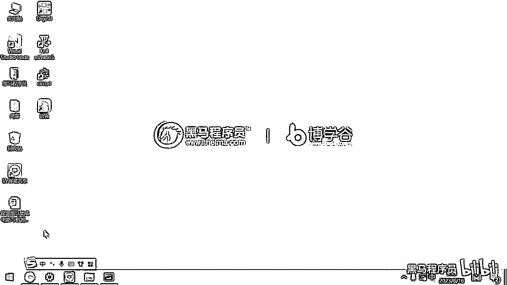
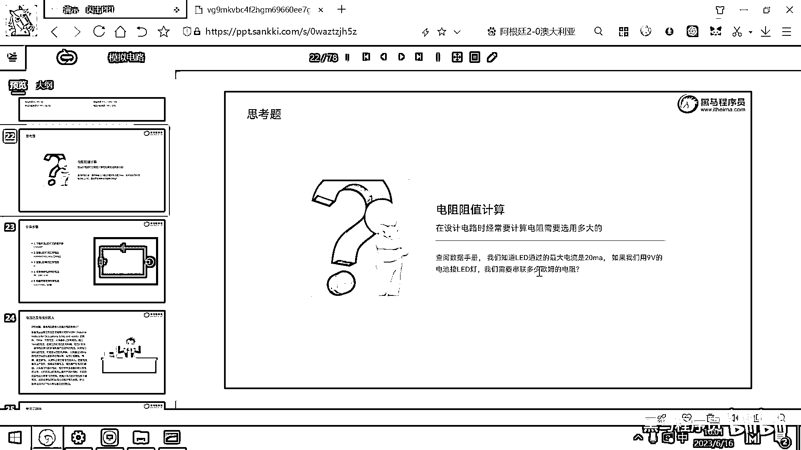
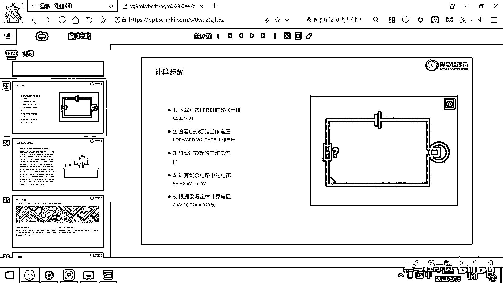

# 黑马程序员嵌入式开发入门模电（模拟电路）基础，从0到1搭建NE555模拟电路、制作电子琴，集成电路应用开发入门教程 - P7：08_欧姆定律 - 黑马程序员 - BV1cM4y1s7Qk

好。

那我们接下来的话呢，刚才的这个实验大家看到了，升高这个LED灯，电机就会转得更快，对吧，那升高电压后就会产生更大的电流，然后电机转得更快，LED灯就更亮了一点，那电压呢还是不能无限增大的。

如果过大的电压会导致LED灯的烧毁，或者电机的烧毁对吧，好，这是这样的一个实验的小结论，好，右边这个哥们大家见过吧，这个是雷电法王杨永信，对吧，那如果你看这个新闻联播，或者看b站的话，就知道。

他在b站上很有名气，那他开了一家医院，专门治疗网瘾，那怎么治疗呢，就是你要是上网有瘾的话，就被家长送到他这儿垫一垫，只要增大电流，多大的网瘾都可以治好，这就是这个雷电法王杨永信，好，那下面我们来看一下。

电学的一个非常重要的定律了，就叫做欧姆定律，欧姆定律，它一定要跟电阻放在一起，使用，因为欧姆定律里面，有一个重要的参数，就是电阻，好，那电压呢产生电势差，它可以推动电流的流动，但是呢，在电路当中。

还会有一种元器件，它可以阻碍电流的流动，这个元器件就是电阻，这个元器件就是电阻，好，关于电阻，有一个非常有意思的图，大家看一下右边的图，你理解了，就明白了，电压电阻电流之间的关系，好，电阻它的作用就是。

阻碍电子的流动，那一个电子想从这过去，为什么想从这过去，因为，有电压，对吧，有电势差，它要推动电子的移动，但是电阻呢，又阻碍电子的移动，这个东西就是电阻，电阻是电子学当中的一个重要的概念，它是指。

如果电流流动经过电路的时候，所产生的阻碍的程度，电阻的单位是欧姆，电阻的单位是欧姆，好，那电压电阻电流之间的关系，大家再看一下这个图，好，那下面的定律是欧姆定律，这个是初中物理。

我们学的最重要的一个定律了，对吧，你明白，I=u/R，基于这样的一个公式，我们可以产生两个变形，把R挪到左边，就是u=I*R，然后把爱挪到右边，就是R=电压/电流，好，这个公式，大家来看一下。

有这么一个印象，好，欧姆定律，它是电学当中的最基础的定律，它描述的就是电压，电流电阻之间的关系，基于这个公式，我们就以之任一两个，就可以推算出来另外一个，好，那为了熟悉欧姆定律，我们这有一些题目。

大家一起做一下，欧姆定律就了解了，好，你看在一条电路中，有一个电阻是2欧，对吧，电流是3安培，我们应该用哪一个公式，有电阻有电流，对吧，有电阻有电流，电阻是2，然后电流是3，2乘以3。

是不是就算出来电压是6了，对吧，二三得六，同样的，如果一个电路当中两个电阻，一个是4欧姆，一个是6欧姆，电流为2安培，电压是多少，4加上6应该等于10，对吧，两个电阻的话，就10欧姆了。

10欧姆乘以2安，算出来就是20伏了，好，这些题目都是初中物理题，大家套一套右边的公式，简单了解一下就可以了，好，关于欧姆定律，我们在使用欧姆定律的时候，有两种电路的连法，一种就叫串联电路。

一种是并联电路，串联电路和并联电路，大家一定要搞清楚，它的电流的关系，电压的关系，以及电阻的关系，好，对照着这个图，我们来给大家一起看一下，好，大家看串联电路，串联电路，是不是整个电路，都是由一根导线。

串着一个电阻，又串了另外一个电阻，电流大家想就跟水管一样，电流是不是应该在任意一个位置，电流大小都是一样的，对吧，大家想生活常识，你把它理解成是一个水管，不可能这边的水流多，然后这边的水流少。

这样就不符合生活常识了，对吧，如果是串联电路的话，电流通过这儿流过第一个电阻，再流过第二个电阻，再回来，好，电压的关系，每一个电阻，它是不是都会分担一部分的电压，所以R1+R2，R1电阻和R2电阻。

它们所对应的电压，U1加上U2，是不是就等于，整体电路的电压，对吧，这两个电阻串在一起，变成了一个更大的电阻，所以电阻R就等于R1+R2，好，电压分配的话，肯定是电阻越大的，它分的电压越多，对吧。

U1除以R1等于U2除以R2，因为U除以R2等于电流，所以这两流经，这两个电阻的电流，也是一样大小的，这是串联电路，好，右边有一个并联电路，并联电路就更有意思了，对吧，你看，我们可以把它想象成电池。

然后连上了一个电阻，对吧，然后电池再连上了下面的一个电阻，这有点类似于一个水管，到这个地方之后，是不是分成两个细水管了，然后这两个细水管流完之后，再回到我们的电路的负极，对吧，所以电流整体的I。

它就等于I1加I2，I1是个小水管，I2是个小水管，它们两个加起来电流，等于I，电压关系，U跟U1 U2电压，都是完完全全一模一样的，对吧，它们接的都是电池的电压，好，电阻计算就有一个特殊的公式了。

就是整体的电阻R分之一，等于R1分之一，加上R2分之一，好，这是我们的一个电阻的关系，电压分配的关系，也是I乘以R得出来的，就是我整个电路的电压，对吧，这两个电路的电压是一样的，好，学习欧姆定律。

对我们而言，最重要的是什么，我们学完了欧姆定律，要能够基于物理学的公式，去设计你的电路当中，你应该选用多大的电阻，对吧，等到后面我们就要设计原理图，然后自己画板子了，我选多大的电阻。

才可以让灯正常的亮起来，电阻的阻值，我们需要利用欧姆定律，把它给计算出来，好，下面我们就把这样的一个流程，来带着大家跑一下，如何查阅数据手册，然后去计算LED灯。

应该需要一个多大的电阻。

(字幕製作/時間軸:秋月AutumnMoon)。

