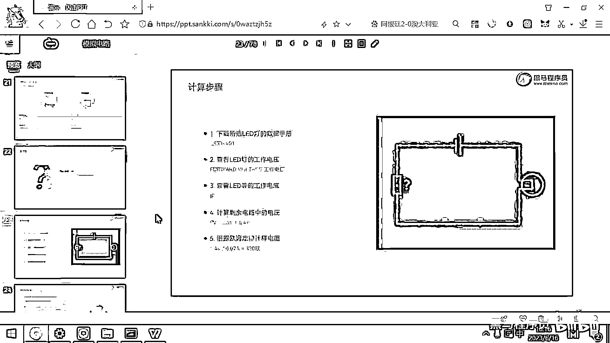
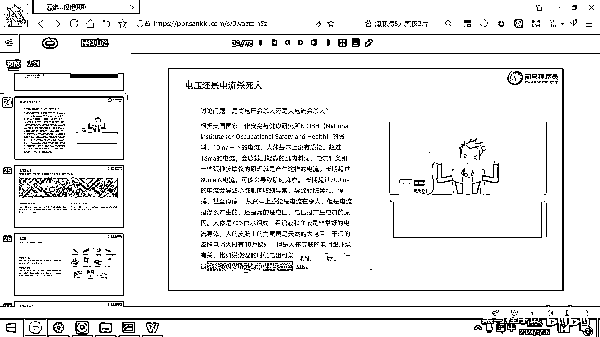

# 黑马程序员嵌入式开发入门模电（模拟电路）基础，从0到1搭建NE555模拟电路、制作电子琴，集成电路应用开发入门教程 - P9：10_安全电压 - 黑马程序员 - BV1cM4y1s7Qk

接下来呢 我们来给大家补充一个生活常识了。

这个也跟我们安全操作呢 有关，好 那到底是电压很危险 还是电流很危险呢，到底是高电压会杀人 对吧，还是大电流会杀人，好 那下面的这个资料呢 是基于这个叫美国的NIOSH。

就是什么国家安全与健康研究所里面的一个报告，这个报告呢 就是10毫安以下的电流，人体是没有感觉的，那还记得什么东西是10毫安吗，我们单片机的待机电流就是10毫安 对吧。

你把这个USB线插上 拿着这些开发板，你的手呢 是没什么感觉的，因为10毫安以下的电流 人体没有感觉，但是呢 人实际上有一个非常灵敏的器官，这个器官就是舌头，10毫安以下的电流 你用手摸着没感觉。

但你用舌头舔 你能舔出来麻麻的 稍微有一点甜，那这个就是10毫安的电流 舌头可以感觉到，好 那超过16毫安的电流 肌肉呢 就会有一些微微的刺痛，那市面上 我不知道大家买过没有。

那什么SKG的什么颈椎按摩仪啊，然后还有什么反正抗疲劳的 有很多的这种按摩仪，这些按摩仪的原理呢，其实都是把一些电极片贴到你的皮肤上，产生一个大概16毫安到20毫安左右的电流，然后你就刺痛刺痛的。

然后血液流通变快了，你感觉你的某一个地方就很舒爽，好 这个呢就是16毫安的电流，肌肉呢 就会有一些刺痛，那市面上的这些按摩仪原理呢 就是这个样子的，好 那一般呢 像一些中医院。

比如说保安中医院 它有这个针灸推拿的这个科室，他们有一些医疗器械 然后先给你扎针灸，然后他会在这个钢针上去接这个电线，它的电流呢 大概就是25毫安左右，那针灸 然后加一些电刺激。

你的一些扭伤呀 或者腰间盘呀 就就恢复的会快很多，好 这是针灸治疗的一些原理，也是拿微弱的电流去刺激刺激人，好 那长时间的80毫安的电流，就会导致这个肌肉麻痹了，好 80毫安的电流就会导致肌肉麻痹。

那资深的电工再去操作一些电的时候，要么就是用这个表先仔细的量一量 对吧，要么呢 就是叫手背试电 什么意思呢，就是电工操作去测试这个电的话，一般都是手背试电 手背试电的原理呢。

就是一旦手触电了 就会产生这个肌肉麻痹，人体默认的这个条件反射呢，就是握紧手 然后往回说，所以你用手背触电 你被电一下之后，你往回说 然后握紧手 那这个就没事了，但是有一些人呢 摸这个电线。

他是去抓这个电线 对吧，他手捏这个电线，那捏完之后肌肉麻痹了，然后默认条件反射就是抓得更紧，然后往下去摁，所以你看到一些触电的，他在这儿抖抖抖抖 然后就是走不开，这个原因呢 是因为肌肉呢已经麻痹了。

他脑子知道我要离开这个地方，但是身体呢已经不受控制了，好 这是80毫安的电流，那超过300毫安的电流呢，就会影响心脏了，会导致这个心跳的紊乱，那甚至心脏的骤停，超过300毫安的电流，那。

在我们这个创威楼下有一个，有一个设备，那个设备呢，是叫AED，大家有几个门底下是有的，好 有些人的心脏可能出现了一些问题，就突然间心脏不跳了，对吧 或者是心肌这个，抖动起来了，那拿一个那个设备。

那个设备实际上是什么呢，那个设备就可以发出来一个，800毫安左右的，瞬间的电流，这个电流呢一电，就可以让整个这个心脏的所有的心肌细胞，暂停工作个几毫秒，然后暂停工作个几毫秒之后。

它又可以整齐的按照节奏的跳动起来了，这个就是，楼下的那些救命设备的原理，你的心脏紊乱了出问题了，心肌跳动不起了，我拿800毫安的电流电你一下，那让你们重启，就相当于是心脏重启了一下。

可以去治疗这个短时间的这个心脏的，揍停呀或者紊乱，好这是，这是这样的一个电流，好那从这个资料上看，大家看到资料上写的都是电流，对吧，感觉是电流大了很危险，但其实这个电流是怎么产生的呀，就是靠电压产生的。

对吧，只有有了电视插才会产生电流，那人体呢，这个有70%是由水组成的，但是人的这个手呀，是一个天然的大电阻，这个手你拿万用表去测，都测不出来电阻的，这个电阻呢，超过10万欧，但是呢，如果你手摸点水。

然后再测，就可以测出来电阻了，可能有个六七百欧，1000欧，三四百欧，这个都有可能，好那所以呢，潮湿环境下呀，这个皮肤电阻只有个几百欧，那你拿一个36伏的电压，你去除以一个几百对吧。

比如说我们除以200，那这个得到的是多少呀，36伏除以除以400吧，48 32 49 36对吧，36伏除以400呢，这个大概就是90毫安，90毫安，那这个时候就有一点肌肉麻痹了，对吧，就麻一下。

好所以安全电压呢，是36伏以下，是安全电压，超过36伏的电压呢，实际上都是有些危险的，像有很多电动车电池呢，都是48伏，还有一些呢，那种那种暴力魔改的电动车，可能他的电压呢，什么72伏的这种离电池都有。

对吧，那超过36伏的电压呢，实际上还是有些危险的，比如说48伏的电池，你的手呢，又比较潮湿，你去摸了这个电池的正负极，他在一瞬间呢，就可以出来很大的电流，都可以把这个手呢，给烧出来一个，烧出来一个泡。

就是你你的手很潮湿，然后摸了48伏电池的正负极，你就突然感觉手热了一下，然后上面就出来了一个泡，这个还是有一定危险的，我们安全的电压呢，是36伏以下。

36伏以下。

謝謝。